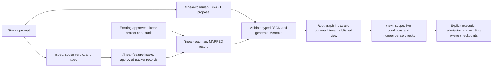
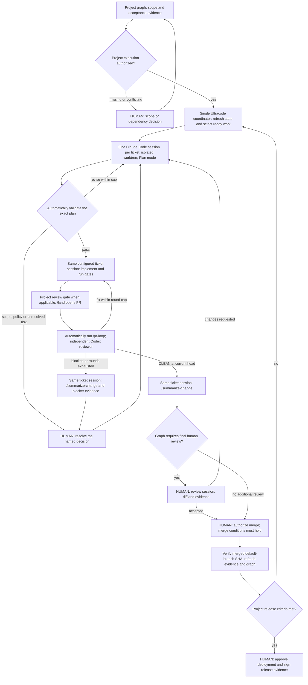

# Project orchestration graph

Status: experimental workflow specification, 2026-10-06. This is the reusable
project-level template. It describes the requested controller; it does not install
one or change `/wave`'s existing approval behavior.

## Central source and reusable preparation

The canonical lifecycle is this root file. The structural contract is
[`graph.schema.json`](tools/linear/linear-roadmap/references/graph.schema.json),
version 1; its [format and publication rules](tools/linear/linear-roadmap/references/contract.md)
explain typed event conditions and project/subunit grouping. Projects keep domain
data in one authoritative `orchestration/<slug>.json`, named by the machine-readable
`orchestration/index.json`; their root `ORCHESTRATION.md` shows its generated view. Use [the root template](project-template/ORCHESTRATION.md) and
[manifest example](project-template/orchestration.json); do not fork this lifecycle.

Preparation composes existing authorities:

[`/linear-roadmap`](tools/linear/linear-roadmap/SKILL.md) prepares local artifacts
and reads the tracker. `/spec` remains the scope authority and intake remains the
ticket-writing authority. Existing approved tickets skip those creation steps.
A simple prompt can draft a graph; it does not authorize execution. `/next`
consults indexed manifests, distinguishing plan, build, merge and release conditions
with live evidence. Its existing scope and parallel-independence checks still apply.

The human maintainer manually publishes one central Linear contract outside pilot
projects, following the workspace contract and verifying read-back, with the source
commit/PR and schema version. The available connector supports a team-owned
document rather than a workspace-root parent. Link that shared document from
each project/subunit; keep each pilot's issue IDs in a separate project document.
Links inherit actual access controls and do not grant access to other teams.
Each repository's `orchestration/index.json` requires `source_revision`, the full
reviewed kstack commit SHA. Both roadmap and `/next` use `validate-index` to check
it against the physical installed HEAD and refuse mismatches/dirty source. They
never silently repin. Each active manifest holds all its projects/subunits, so
uniqueness and cycles are checked together. Source changes require explicit
reconciliation; a matching pin is not execution approval.

## The graph

One Ultracode coordinator owns the project graph. Each executable ticket/unit
has one persistent Claude Code session and one isolated branch/worktree. The
session starts in Plan mode, receives automatic plan validation, implements,
opens its PR, runs independent review, and briefs the human in that same session.
Human nodes are decisions, not status decorations.

The `fix` arrow depicts work inside the bounded `/pr-loop`; it does not reset its
round counter. A terminal verdict has no automatic retry. A new attempt requires
a recorded human decision and carries forward unresolved findings.

## What exists and what still needs integration

| Requirement | Existing support | Integration still needed |
| -- | -- | -- |
| Prepare and select scoped work | `/linear-roadmap`, schema validator, graph-aware `/next` | Live controller admission and scope-exception routing; offline validation proves structure only |
| Coordinate one batch | `/wave` Workflow script, records, seam check | Project loop, durable graph state and resumption |
| Plan then implement | `/dispatch-implementation`, `/wave plan` and build | Automatic plan validator; current wave requires human approval |
| One reviewable session per ticket | Claude Desktop supports local sessions and CLI session handoff | Persist session ID across plan/build/fixes; prove graph agents are the intended session |
| Pin Opus 5.5 and effort | Claude Code supports `claude-opus-5-5`, `high` and `xhigh` | Set and read back actual settings for every ticket session |
| Independent PR review | `/pr-loop`, project review gate | Launch on convergence; preserve caps, head SHA and reviewer identity |
| Brief the human | `/summarize-change` | Mandatory invocation in the ticket session before each human review |
| Notify at human nodes | Desktop completion notifications | Targeted handoff with session link, summary, PR, SHA and the decision required |

`/wave` currently launches separate workflow agents for planning, building and
review, stops at human plan approval, and selects no next wave automatically.
Its agents are inspectable as workflow tasks; that alone does not prove a
persistent, separate Desktop session per ticket. Do not claim these requirements
are implemented by enabling Ultracode or renaming a workflow node.

The next implementation should be a thin project controller and session adapter
that reuse the existing skills. No new `/orchestrate` command exists yet. Validate
host session capabilities before choosing its API; do not invent launch flags,
Workflow options or a Desktop automation API.

## Session and plan policy

- One coordinator session uses Ultracode. Ticket sessions implement only their
  assigned unit; they do not independently expand the project graph.
- Each ticket has a stable mapping: issue ID, session ID and Desktop navigation
  handle, branch, absolute worktree, plan revision, PR URL and current head SHA.
  Recover an existing mapping before creating a session. Never silently create a
  replacement session for a review fix or restart.
- Pin `policy.implementation_model` and `policy.default_effort`, with each unit's
  explicit effort override when needed. Record the difficulty reason and actual
  resolved settings. The MVP pilot's Opus 5.5/high-or-xhigh choice is project data,
  not a universal model literal. A substituted model/effort is a mismatch to report.
- Start every ticket session in the host's actual Plan mode. A prompt saying
  "plan first" is not proof that Plan mode is active. After validation, resume
  that same session with execution permission limited to the validated plan.
- Automatic plan validation checks acceptance criteria coverage, file scope,
  dependency conditions, runnable tests, project gates and unresolved decisions.
  It uses a distinct validation context rather than an implementer's self-approval.
  It returns PASS, REVISE or HUMAN_REQUIRED with evidence. Bound revisions with
  `policy.max_plan_revisions`; exhaustion stops at a human node. The validation
  verdict HUMAN_REQUIRED and rehearsal state both name an unresolved decision.
- Bind PASS to the exact plan content digest, issue criteria, fetched base SHA and
  scope evidence. Changed plan, base or criteria invalidates the approval. An
  automatic PASS cannot authorize scope expansion, policy changes, a merge,
  production deployment or a human-owned decision.
- Automatic plan approval is this experiment's requested policy. It is not a
  fabricated human `/wave build --approve` invocation and does not override the
  current wave/dispatch guard. Implement an explicit opt-in path before use.

## Dependencies, evidence and human decisions

Keep distinct edge types: `start_after`, `merge_after`, `release_after`,
`evidence_required`, `human_decision`, `verify_after`, and `review_after`.
Any edge targeting plan/build is a start prerequisite. Native Linear blockers
target plan and retain `/next`'s existing blocked-issue precedence; an upstream
engineering blocker requires verified merge. Build-only graph edges never relax
an open native relation. See the format contract for other source kinds and typed
edge constraints. Generate the view from the combined manifest and observations.

The manifest records each condition's source. Verifier, evidence, result and
observation time belong in the root Conditions table or future runtime ledger,
not extra edge fields. Before a controller exists, human decisions live as original
scope decision-log entries or Linear comments by authorized humans, indexed in the
root Human decisions table with actor/date, exact boundary and manifest digest.
`/next` reads and verifies these original records; it creates no approvals.
A merged PR requires confirmation that its changes reached the fetched default
branch; a release requires its real tag and gate artefacts. CLEAN review applies
to a head SHA, not to a branch name. Missing evidence is UNKNOWN. Conflicting
issue, project and scope records become a named decision before affected work
starts; do not use a status write to bypass a scope refusal.

Human decisions are required for scope/contract changes, unresolved plan or
review questions, blocked/exhausted reviews, merging, deployment and release
sign-off. The graph can additionally require final code/product review for a
public surface, access control, budget rules, audit retention or uncertain
acceptance evidence. This additional review can be conditional; merge authority
remains human in every case.

Before pinging the human, the ticket session calls `/summarize-change` on its
actual PR/current change, including known failures or incomplete work. After any
review fixes, refresh the summary and bind it to the new SHA. Deliver one handoff
per new decision: session navigation handle, summary text, PR/diff, current SHA,
gate results, reviewer verdict and the exact decision. Stay quiet while nothing
actionable changes. The coordinator can show the handoff; external messages use
only a channel authorized by the human. No notification schedule is installed by
this document.

## Resumption and bounded execution

Store future runtime state beneath
`${KSTACK_STATE:-$HOME/.kstack}/projects/<stack.yml project>/orchestration/<manifest slug>/`,
not in the tracked graph. The repo key and manifest key are different namespaces. Acquire one coordinator lease per project;
record an append-only transition ledger, approval evidence and graph revision.
Before restarting, reconcile sessions, worktrees, PRs and default-branch state.
Do not replay a side effect merely because a workflow node was interrupted.

Only select the next wave after the human merge decisions and integration checks
for the current one. Respect `/next`'s independence evidence, `/wave`'s seam checks
and the resolved review cap: the lower of `policy.review_rounds` and configured
`wave.max_review_rounds`, passed explicitly to `/pr-loop`. Review concurrency is
the lower of `policy.review_concurrency` and configured wave review concurrency;
ticket concurrency is bounded by `policy.max_sessions`. Report all resolved values.
Pilot choices live in that pilot's project document/manifest, not this lifecycle.

Session orchestration policies above remain specification/prompt-level. The
roadmap script enforces structural and combined-event checks; it does not verify
live approvals or run a controller. Existing wave script checks cover its own
routing; they do not enforce this new controller. A controller is ready only when a live dry run proves session
identity, Plan mode, model/effort, validation, review launch, summary handoff and
restart behavior without duplicate work or unauthorized transitions.

## Start the experiment

1. Prepare the project with `/linear-roadmap`, validate its manifest and put the
   generated view/index at the consuming root using
   [the project template](project-template/ORCHESTRATION.md). Pin the reviewed
   shared-source revision and link the separate pilot from its Linear overview.
2. Use `/next`'s graph-analysis step for the read-only rehearsal. Its contract
   defines UNMAPPED, ACTIVE, HUMAN_REQUIRED, UNKNOWN, BLOCKED, PLAN_ONLY,
   READY_TO_BUILD and MERGE_BLOCKED from verified event evidence. Do not dispatch.
3. Prove the session adapter on one existing or approved unit, then implement the
   automatic-plan path explicitly. Keep human merge and release checkpoints.
4. Run one bounded wave; compare the observed transitions against the graph before
   enabling project-wide continuation.

Official capability references checked on 2026-10-06:
[Ultracode and workflows](https://code.claude.com/docs/en/workflows),
[model and effort configuration](https://code.claude.com/docs/en/model-config),
[Desktop sessions and handoff](https://code.claude.com/docs/en/desktop).
These document product capabilities, not this machine's account permissions or
successful integration. Never substitute a model because an alias changed.
