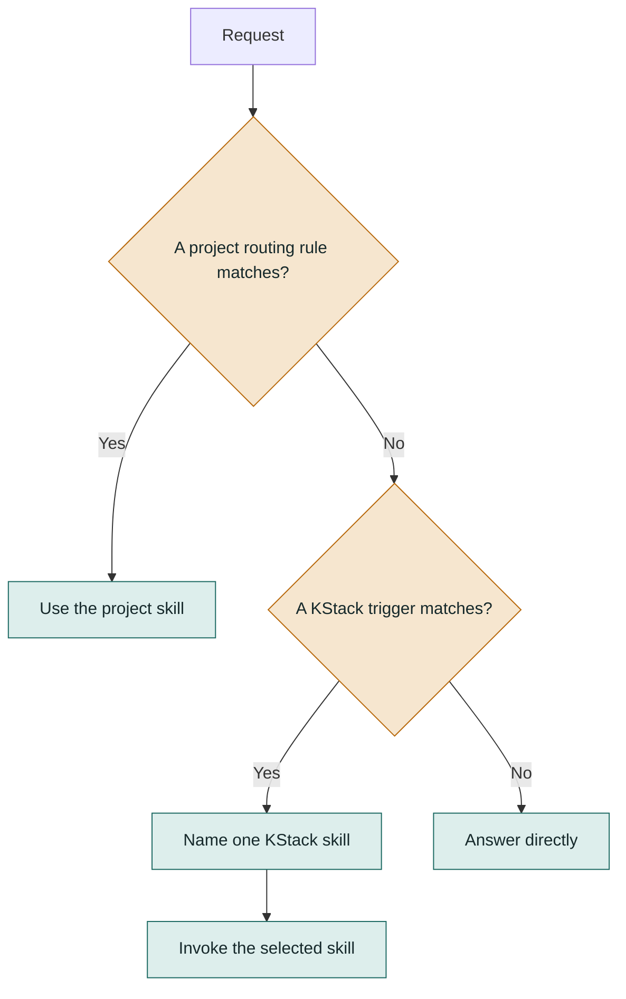
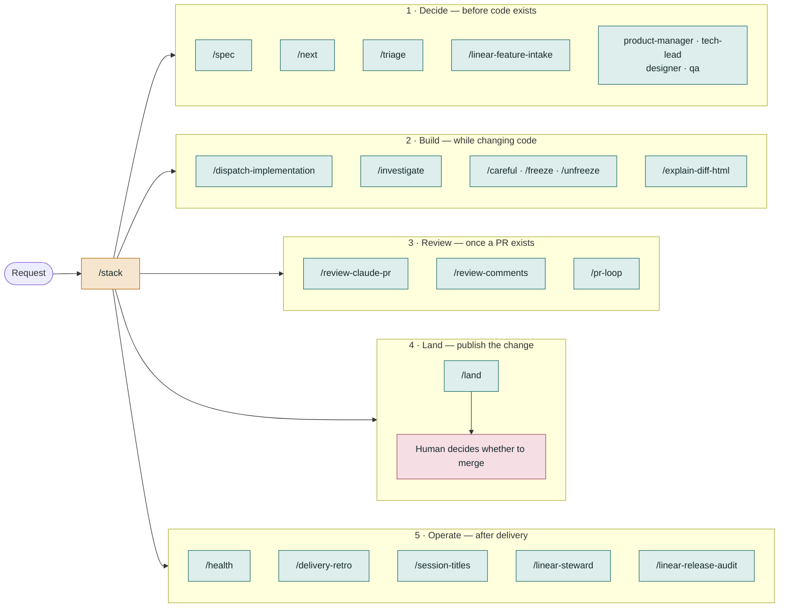
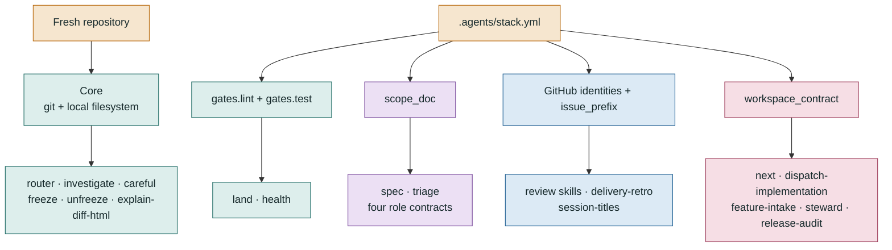
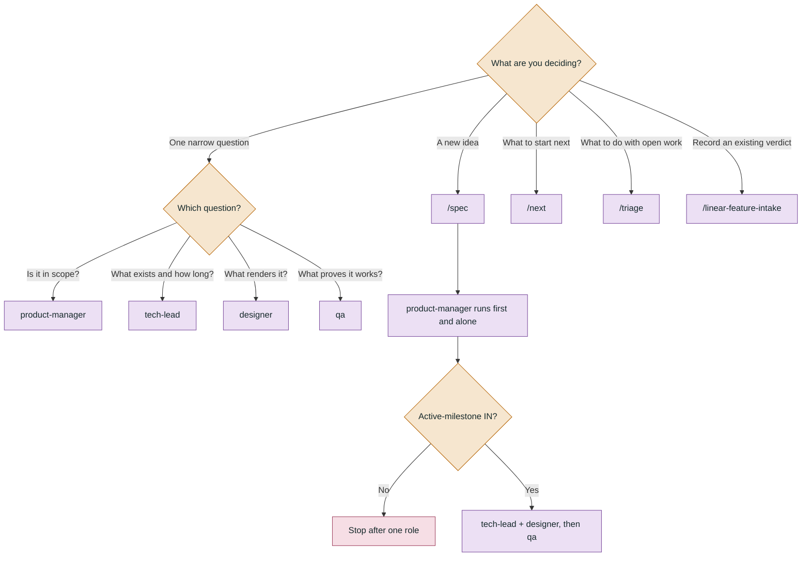
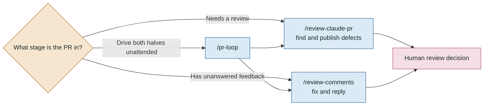

# KStack visual guide

KStack has two independent dimensions:

1. **Workflow phase** — when a skill is useful: decide, build, review, land, or
   operate.
2. **Capability tier** — what the skill needs: local files, a scope contract,
   GitHub, or Linear.

The [`/stack` router](../router/stack/SKILL.md) matches a request to one skill.
It names the route and stops; the selected skill does the work.

> Mermaid diagrams below render directly on GitHub. For filtering by trigger
> phrase or dependency, open the [interactive skill map](skill-map.html) in a
> browser after cloning the repository.

## How the router works

Project skills take precedence because they know the consuming repository's
domain. A project skill with the same name as a KStack skill shadows it.

## The workflow map

The phases describe **when** to use a skill. They do not imply an automatic
pipeline: KStack deliberately does not chain a decision, implementation,
review, and merge into one unattended action.

## The capability tiers

A skill lives in the least capable tier that can still deliver its core value.
The tiers are not quality levels; they describe dependencies.

| Tier | Core dependency | Skills |
|---|---|---|
| Router | Local files | [`/stack`](../router/stack/SKILL.md) |
| Core | Git + local filesystem | [`/investigate`](../core/investigate/SKILL.md), [`/careful`](../core/careful/SKILL.md), [`/freeze`](../core/freeze/SKILL.md), [`/unfreeze`](../core/unfreeze/SKILL.md), [`/explain-diff-html`](../core/explain-diff-html/SKILL.md), [`/land`](../core/land/SKILL.md), [`/health`](../core/health/SKILL.md) |
| Roles | `scope_doc` | [`/spec`](../roles/spec/SKILL.md), [`/triage`](../roles/triage/SKILL.md), [`product-manager`](../roles/product-manager.md), [`tech-lead`](../roles/tech-lead.md), [`designer`](../roles/designer.md), [`qa`](../roles/qa.md) |
| GitHub | `gh` plus configured identities or issue prefix | [`/review-claude-pr`](../tools/github/review-claude-pr/SKILL.md), [`/review-comments`](../tools/github/review-comments/SKILL.md), [`/pr-loop`](../tools/github/pr-loop/SKILL.md), [`/delivery-retro`](../tools/github/delivery-retro/SKILL.md), [`/session-titles`](../tools/github/session-titles/SKILL.md) |
| Linear | Linear workspace + `workspace_contract` | [`/next`](../tools/linear/next/SKILL.md), [`/dispatch-implementation`](../tools/linear/dispatch-implementation/SKILL.md), [`/linear-feature-intake`](../tools/linear/linear-feature-intake/SKILL.md), [`/linear-steward`](../tools/linear/linear-steward/SKILL.md), [`/linear-release-audit`](../tools/linear/linear-release-audit/SKILL.md) |

Missing configuration is a supported state. A skill either asks for the missing
judgment or refuses and names the exact key; it never silently invents a value.

## The decision cluster

`/next` and `/triage` are complements: `/next` looks forward at what to start;
`/triage` looks backward at work already left open.

## The review cluster

The split preserves two identities: the reviewer publishes findings, while the
bot fixes code and answers existing feedback. `/pr-loop` orchestrates both but
is bounded by a round cap and repeat-finding detection.

## The constraints that shape KStack

- `/land` stops at the pull request; merging is a human decision.
- The scope gate defaults to **OUT** when there is no cited evidence.
- A merged pull request is not evidence that a release gate passed.
- Commits, changed lines, and pull-request counts are never outcome scores.
- Acceptance criteria must name a runnable check or be explicitly classified
  as human judgment.
- Enforcement is labeled honestly as hook-enforced, tool-list-enforced, or
  prompt-level.

For exact routing phrases and tie-break rules, read the canonical
[`/stack` contract](../router/stack/SKILL.md).
