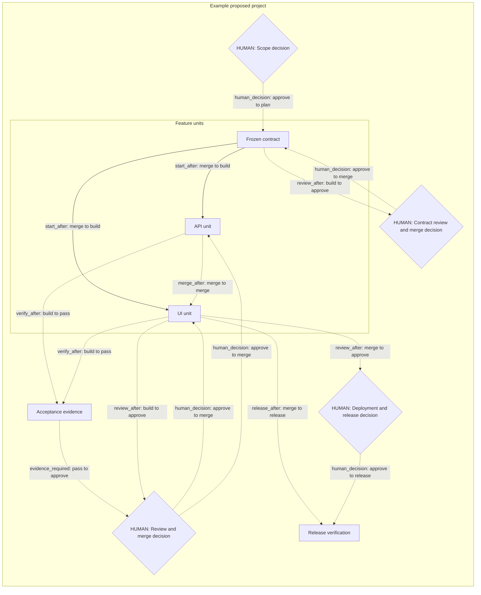

# Project orchestration

Status: fill in project-specific records before dispatch. This file belongs at
the consuming repository root; link it from the Linear project overview.
The reusable lifecycle lives in kstack's root `ORCHESTRATION.md`; read that file
through the physical installed stack root. Keep the project's dependencies and
human checkpoints here rather than duplicating the lifecycle procedure.

## Source revision and roadmap index

- Central Linear contract and reviewed source PR: fill in.
- Machine index: `orchestration/index.json`, adapted from `project-template/orchestration-index.json`.
- Exactly one active manifest: the index's `manifest` path; schema version 1.
- Observation time and unresolved conflicts: fill in from live reads.

Resolve the installed roadmap directory physically (Claude symlink via `pwd -P`,
or Codex pointer's canonical path), then obtain `<stack-root>` using
`git -C <physical-skill-directory> rev-parse --show-toplevel`. Run:

```text
python3 <stack-root>/tools/linear/linear-roadmap/bin/graph-record validate-index <absolute-consuming-root>/orchestration/index.json
python3 <stack-root>/tools/linear/linear-roadmap/bin/graph-record render-index <absolute-consuming-root>/orchestration/index.json
```

Set the index's source_revision to the explicitly adopted reviewed stack HEAD.
The commands check it against installed source and emit the exact manifest SHA256.
Stop on mismatch; never silently update the pin. `/linear-roadmap` updates the one
manifest with all projects/subunits; `unit_of` groups do not create sessions. An
approved spec needs intake-created executable tickets before mapping. Prompt-only
input can produce DRAFT. Refuse writes if consuming root equals stack root.
This example has no tracker IDs or execution permission.

## Project graph

Replace these labels and conditions with actual issue IDs and gate evidence.
Arrows name their condition; an unlabeled arrow must not be interpreted as
execution permission. Add human nodes at the actual project transitions.



## Scope and execution boundary

- Linear project URL and stable ID:
- Consuming repository and fetched default branch:
- Scope authority and explicit exception, if any:
- Human owner and authorized notification channel:
- Root graph revision and source observations:
- Execution/rehearsal boundary and explicit policy values:

## Conditions

| Node / unit | Start conditions | Merge / release conditions | Evidence / verifier | Human checkpoint | Source |
| -- | -- | -- | -- | -- | -- |
| Contract | Authorized scope | Accepted shared contract | Default-branch SHA | Contract decision + merge | Scope record |
| API unit | Contract merged | Tests, current-head independent review | Gate output + review SHA | If graph requires + merge | Issue body |
| UI unit | Contract merged | API merged, tests, current-head independent review | Gate output + review SHA | If graph requires + merge | Issue body |
| Release | Required units integrated | Acceptance artefacts at deployed SHA | Artefact + production verification | Deploy + release sign-off | Project acceptance |

## Human decisions

Before a controller exists, record verifier, observation UTC time, result and
evidence per condition in the Conditions table; add columns as needed. Index human
decisions below and read their original scope decision-log/Linear comment sources.

| Node/event | Outcome | Authorized actor | Recorded UTC | Manifest sha256 / scope boundary | Original record | Verifier / observed UTC |
| -- | -- | -- | -- | -- | -- | -- |
| TODO: human node/approve | TODO: explicit APPROVE/REJECT | TODO: human actor | TODO: time | TODO: exact digest and criteria | TODO: URL or file:line | TODO: verified observation |

## Human handoff and runtime references

Session ID/handle, worktree, plan revision, actual model/effort, PR/head SHA,
validation/review verdicts and summary text will live in the future controller
ledger; verified manual decisions remain readable sources. The graph may display links to them. Missing observations remain UNKNOWN;
this template has no completed or approved nodes by default.

Record disagreements between project and issue conditions here before declaring
an affected unit ready. Reuse existing sessions; never change issue status merely
to get around a dispatcher refusal. Root graph edits change the visible plan,
not execution permissions or acceptance evidence.
