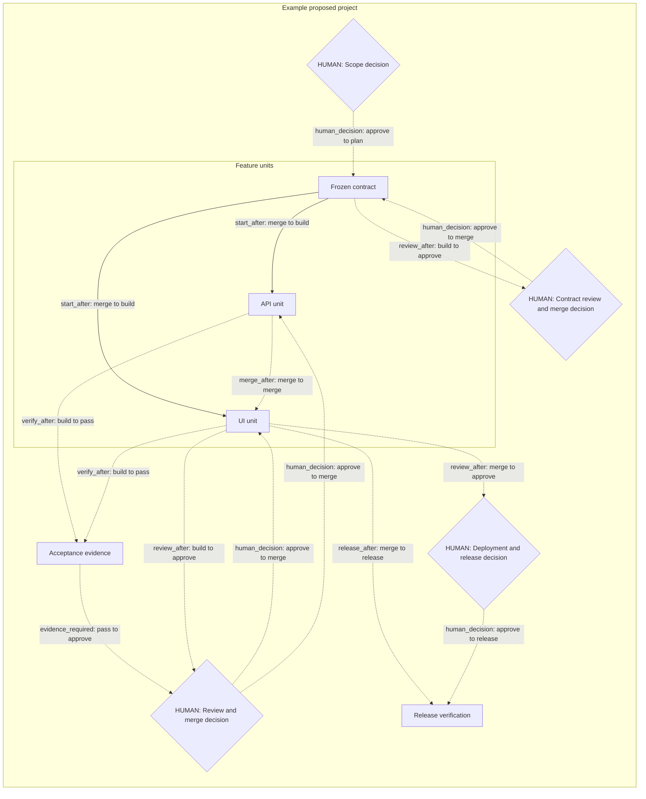

# Project orchestration

Status: fill in project-specific records before dispatch. This file belongs at
the consuming repository root; link it from the Linear project overview.
The reusable lifecycle lives in kstack's root `ORCHESTRATION.md`; read that file
through the physical installed stack root. Keep the project's dependencies and
human checkpoints here rather than duplicating the lifecycle procedure.

## Source revision and roadmap index

- Reviewed kstack commit / PR and central Linear contract URL: fill in before use.
- Lifecycle source: kstack root `ORCHESTRATION.md`; schema version: 1.
- Manifest: `orchestration/<slug>.json`, adapted from `project-template/orchestration.json`.
- Observation time and unresolved source conflicts: fill in from live reads.

Use `/linear-roadmap <project|spec|prompt>` to prepare/update these records.
An approved spec goes through `/linear-feature-intake` for ticket creation first;
existing approved work skips both steps. Prompt-only graphs remain DRAFT.
The root index can list several manifests; `unit_of` groups represent subunits.
The schema and physical validator live with the installed roadmap skill. Run
`graph-record validate` then `graph-record render` on the manifest and replace
only its generated view. This example has no tracker IDs or execution permission.

## Project graph

Replace these labels and conditions with actual issue IDs and gate evidence.
Arrows name their condition; an unlabeled arrow must not be interpreted as
execution permission. Add human nodes at the actual project transitions.

## Scope and execution boundary

- Linear project URL and stable ID:
- Consuming repository and fetched default branch:
- Scope authority and explicit exception, if any:
- Human owner and authorized notification channel:
- Root graph revision and source observations:
- Pilot boundary: one rehearsal, then one wave; two ticket sessions maximum:

## Conditions

| Node / unit | Start conditions | Merge / release conditions | Evidence / verifier | Human checkpoint | Source |
| -- | -- | -- | -- | -- | -- |
| Contract | Authorized scope | Accepted shared contract | Default-branch SHA | Contract decision + merge | Scope record |
| API unit | Contract merged | Tests, current-head independent review | Gate output + review SHA | If graph requires + merge | Issue body |
| UI unit | Contract merged | Tests, current-head independent review | Gate output + review SHA | If graph requires + merge | Issue body |
| Release | Required units integrated | Acceptance artefacts at deployed SHA | Artefact + production verification | Deploy + release sign-off | Project acceptance |

## Human handoff and runtime references

Session ID/handle, worktree, plan revision, actual model/effort, PR/head SHA,
validation and review verdicts, summary text and approvals live in the controller
ledger. The graph may display links to them. Missing observations remain UNKNOWN;
this template has no completed or approved nodes by default.

Record disagreements between project and issue conditions here before declaring
an affected unit ready. Reuse existing sessions; never change issue status merely
to get around a dispatcher refusal. Root graph edits change the visible plan,
not execution permissions or acceptance evidence.
